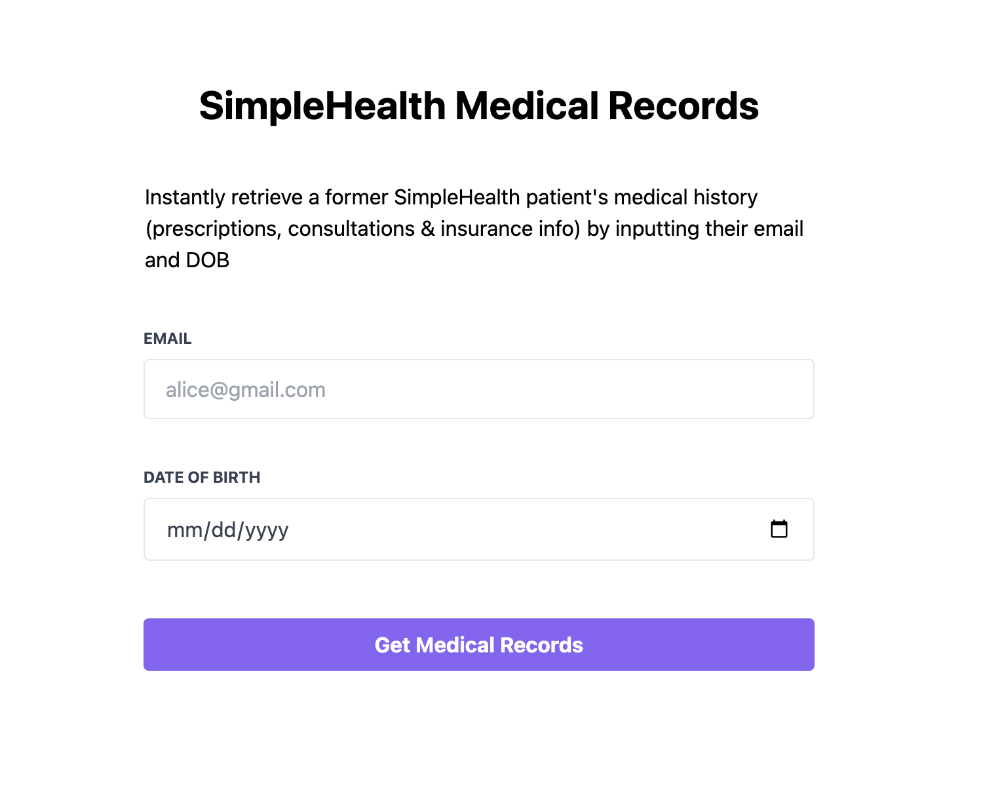
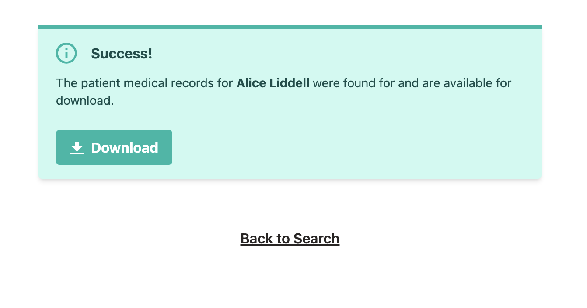
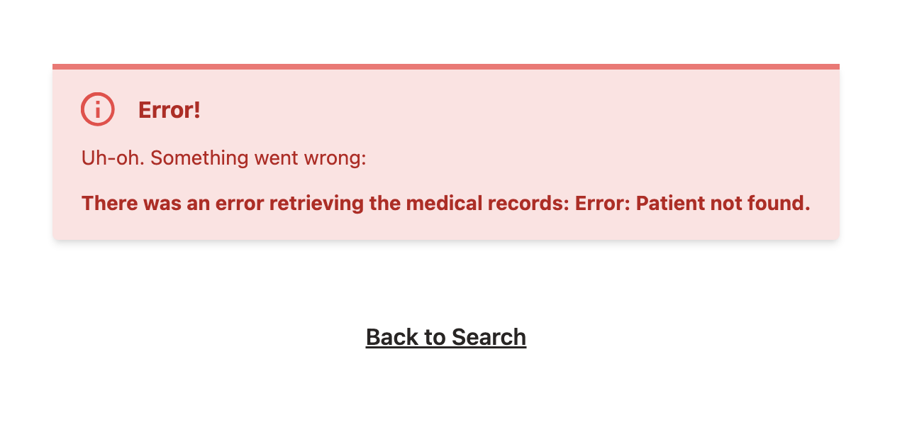
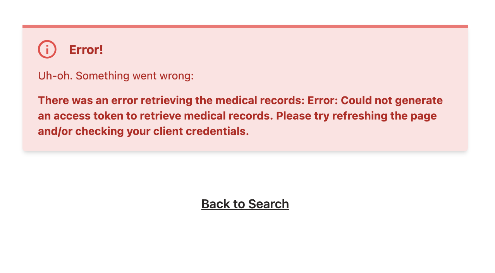
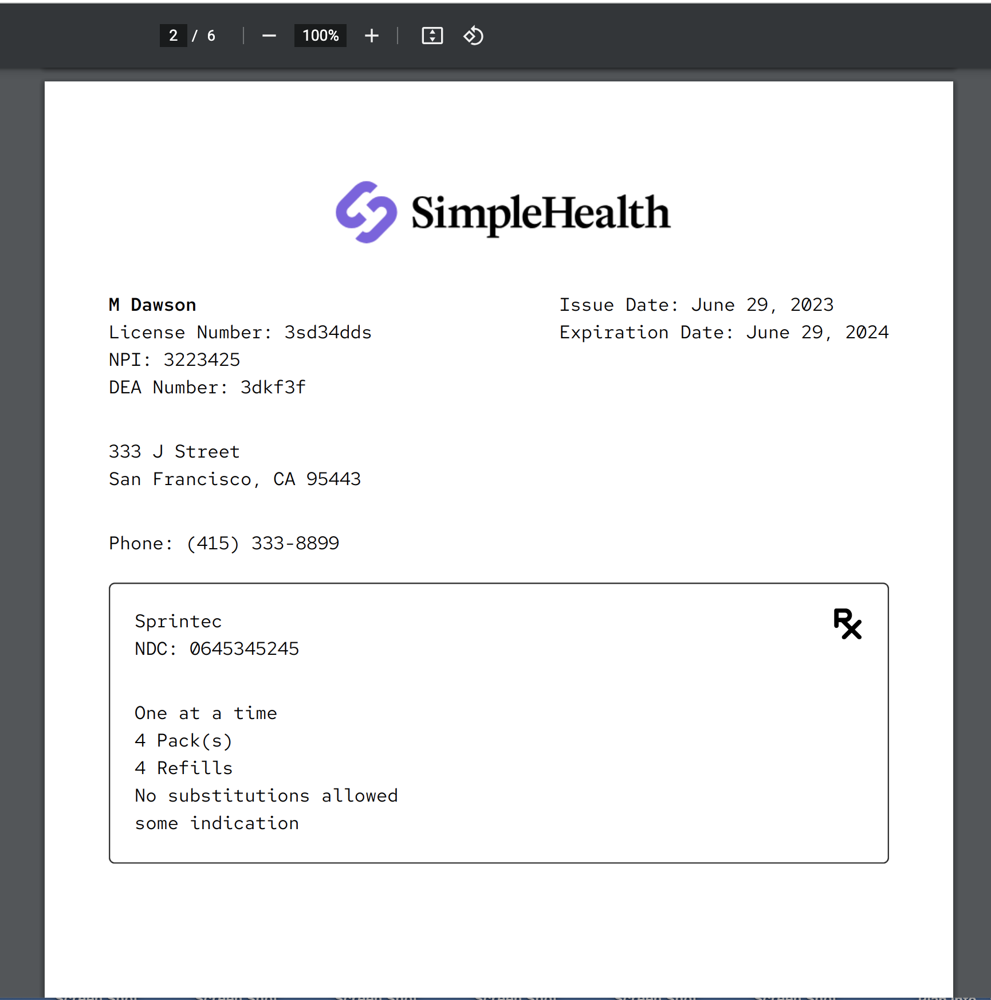
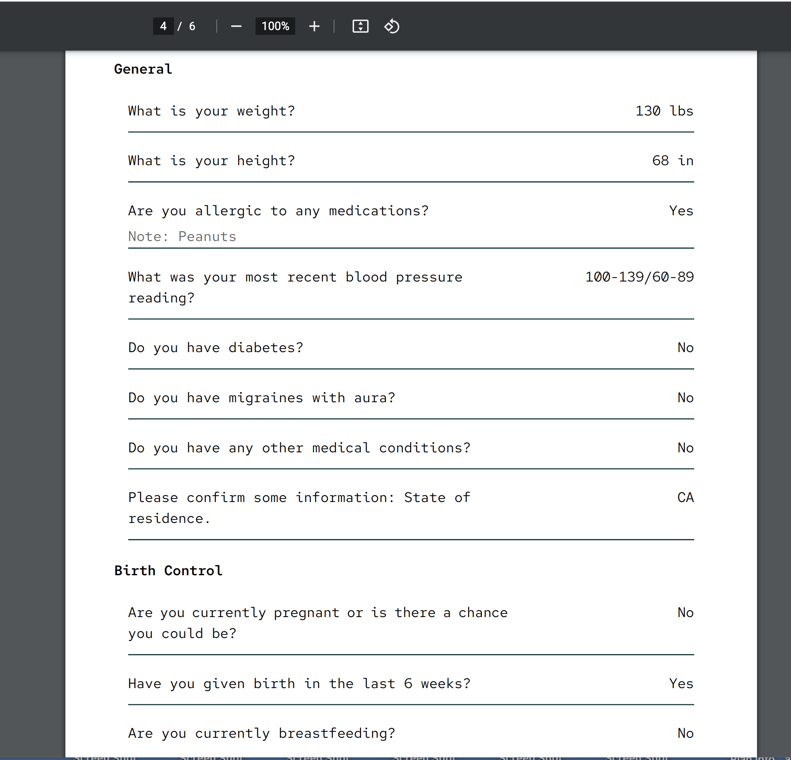
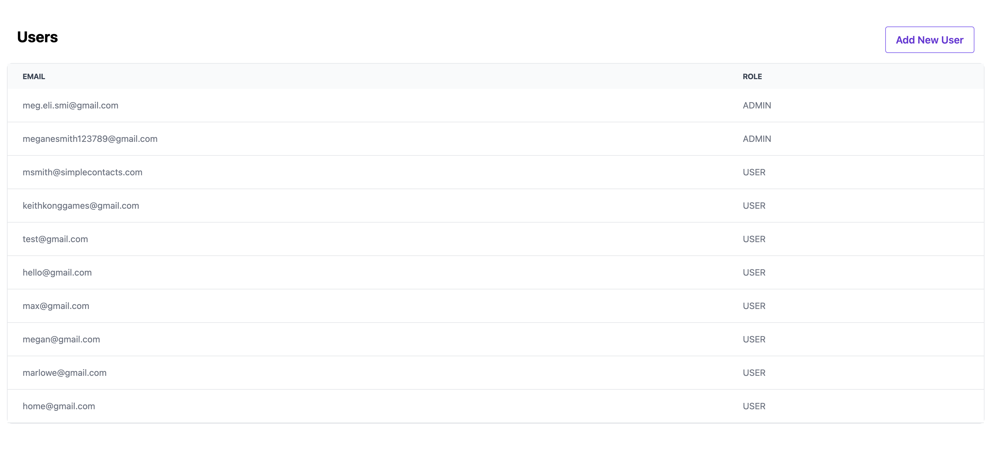
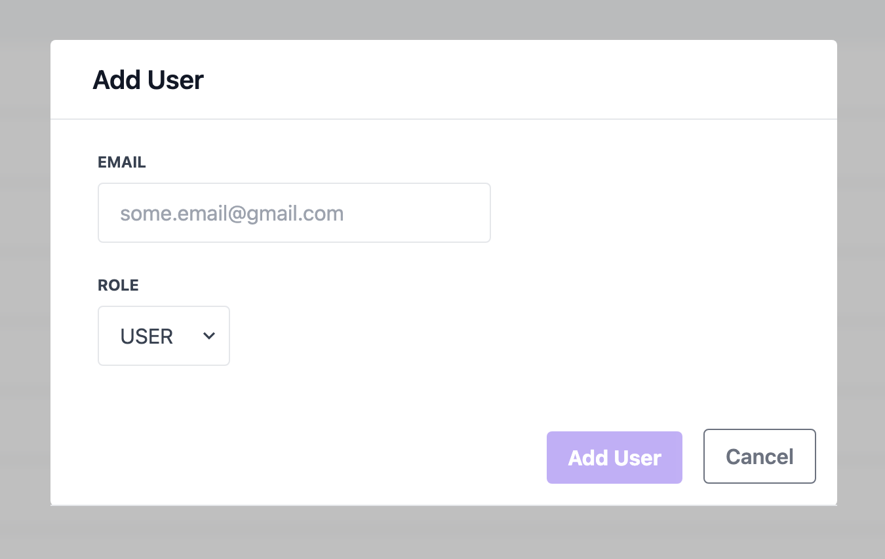

# SimpleHealth Medical Records Frontend

## Table of Contents
1. [About the app](https://github.com/megelismi/sh-medical-record-frontend/blob/main/README.md#about-the-app)
2. [Screenshots](https://github.com/megelismi/sh-medical-record-frontend/blob/main/README.md#screenshots)
3. [Technologies](https://github.com/megelismi/sh-medical-record-frontend/blob/main/README.md#technologies)
4. [Setup](https://github.com/megelismi/sh-medical-record-frontend/blob/main/README.md#setup)
5. [Available Scripts](https://github.com/megelismi/sh-medical-record-frontend/blob/main/README.md#available-scripts)
6. [Credits](https://github.com/megelismi/sh-medical-record-frontend/blob/main/README.md#credits)

## About the app

The SimpleHealth Medical Records application allows us to retrieve the medical history for former SimpleHealth patients. After entering their email and date of birth, you'll be prompted to download a PDF which includes their basic patient info (name, address, telephone etc), prescription history, any insurance policies we have on file and their consultation questions and answers. 

## Screenshots

### The Medical Records Search Page 

### Medical Records Search Success

### Medical Records Search Error - Patient Not Found

### Medical Records Search Error - Client Credentials Not Valid

### PDF - Prescription Record

### PDF - Consultation Record

### Users Page
#### Note: Only ADMINS will see the "Add New User" button

### Add User Form

## Technologies

This application uses 
 * `React`
 * `Typescript`
 * `eslint`
 * `axios`
 * `Google Oauth`
 * `Node.js`
 * `Express`. 
 
 **Note:** User tokens are stored in `Session Storage` and are verified on the local `Node` server. 
 
## Setup

* Download or clone the repository
* Run `npm install`
* Make sure you have a copy of the .env file. If not, you'll need to create one and fill in the following variables 
    * `REACT_APP_MEDICAL_RECORDS_API_CLIENT_ID`: client id for the [medical records API](https://github.com/megelismi/sh-medical-record-api)
    * `REACT_APP_MEDICAL_RECORDS_API_CLIENT_SECRET`: client secret for the [medical records API](https://github.com/megelismi/sh-medical-record-api)
    * `REACT_APP_GOOGLE_OAUTH_CLIENT_ID`: client id for [Google Oauth](https://www.youtube.com/watch?v=roxC8SMs7HU)
    * `REACT_APP_GOOGLE_OAUTH_CLIENT_SECRET`: client id for [Google Oauth](https://www.youtube.com/watch?v=roxC8SMs7HU)
 * Run `npm start`
 * In development, go to `localhost:3000/login`. You'll be prompted to login in using a gmail account. You must have a user account to access the application. In development, you can do this by simply adding your user account to the database connected to the [Medical Records API](https://github.com/megelismi/sh-medical-record-api). Once this application is deployed in production, another admin can add your email on the `/users` page  and that will create your user's account. 
 * As long as the Medical Records API is running and the database is running (and hydrated), you should be able to search for SimpleHealth patient's medical records using their email and date of birth. If you are in development, the database has been seeded with one user: Alice Liddel. Her email is alice@gmail.com and date of birth is `09/30/1988`. 

## Available Scripts

In the project directory, you can run:

### `npm start`

Runs the app in the development mode.\
Open [http://localhost:3000/login](http://localhost:3000/login) to view it in the browser.

The page will reload if you make edits.\
You will also see any lint errors in the console.

### `npm run build`

Builds the app for production to the `build` folder.\
It correctly bundles React in production mode and optimizes the build for the best performance.

The build is minified and the filenames include the hashes.\
Your app is ready to be deployed!

See the section about [deployment](https://facebook.github.io/create-react-app/docs/deployment) for more information.

### `npm run eject`

**Note: this is a one-way operation. Once you `eject`, you can’t go back!**

If you aren’t satisfied with the build tool and configuration choices, you can `eject` at any time. This command will remove the single build dependency from your project.

Instead, it will copy all the configuration files and the transitive dependencies (webpack, Babel, ESLint, etc) right into your project so you have full control over them. All of the commands except `eject` will still work, but they will point to the copied scripts so you can tweak them. At this point you’re on your own.

You don’t have to ever use `eject`. The curated feature set is suitable for small and middle deployments, and you shouldn’t feel obligated to use this feature. However we understand that this tool wouldn’t be useful if you couldn’t customize it when you are ready for it.

## Credits 

* [megelismi](https://github.com/megelismi)
* [jamelclarke](https://github.com/jamel-clarke)

